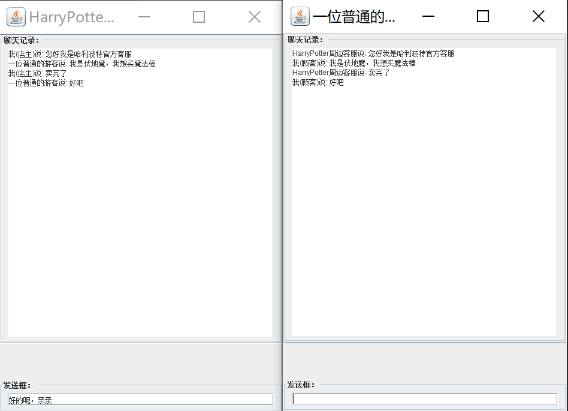

**时间线：**

小红去环球影城哈利波特场馆玩耍，首先玩了魁地奇游戏（状态模式），因为表现好免费获得了一张霍格沃茨“入学”门票，于是去城堡里跟着斯内普教授上了魔药课（观察者模式），参观结束后小红在周边售卖平台上购买周边（中介者模式）。

# 状态模式

对有状态的对象，把复杂的“判断逻辑”提取到不同的状态对象中，允许状态对象在其内部状态发生改变时改变其行为。

（直接把swich语句的每个case都写成一个单独的类）

“魁地奇”是《哈利·波特》系列中重要的空中团队对抗运动Quidditch的中文译名，是魔法世界中由巫师们骑飞天扫帚参加的球类比赛。

每个人5次机会，投鬼飞球或抓金色飞贼有不同的得分（加分或减分），玩家可以选择在任意时刻停止，即可以用完这五次机会也可以不用完。

本游戏由电影中的游戏改编，规则如屑：

每个人可以进行五轮比赛，每轮投进一个鬼飞球可获得10分，抓住金色飞贼的一方可获得150分。 且一轮中只能得到依次分数。

分数小于 30 分时为“没咋进球”状态，没有奖品；当分数大于等于 30 分时为“表现不错”状态，奖励一次和喜爱角色合影的机会，当分数大于50分时为“抓住金色飞贼”状态，奖励霍格沃茨入学机会（即城堡门票一张）。

```java
package cn.tongji.demo;

public class ScoreStateTest {
    public static void main(String[] args) {
        ScoreContext account = new ScoreContext();
        System.out.println("魁地奇成绩状态测试：");
        account.add(10);
        account.add(10);
        account.add(10);
        account.add(10);
        account.add(150);
    }
}

//环境类
class ScoreContext {
    private AbstractState state;

    ScoreContext() {
        state = new LowState(this);
    }

    public void setState(AbstractState state) {
        this.state = state;
    }

    public AbstractState getState() {
        return state;
    }

    public void add(int score) {
        state.addScore(score);
    }
}

//抽象状态类
abstract class AbstractState {
    protected ScoreContext en;  //环境
    protected String stateName; //状态名
    protected String gift; //奖品
    protected int score; //分数

    public abstract void checkState(); //检查当前状态

    public void addScore(int x) {
        score += x;
        System.out.print("加上：" + x + "分，\t当前分数：" + score);
        checkState();
        System.out.println("分，\t当前状态：" + en.getState().stateName);
        System.out.println("您的奖品情况是：" + en.getState().gift);
    }
}

//具体状态类：没有赢得比赛
class LowState extends AbstractState {
    public LowState(ScoreContext h) {
        en = h;
        stateName = "没咋进球";
        gift = "很遗憾，没有奖品...";
        score = 0;
    }

    public LowState(AbstractState state) {
        en = state.en;
        stateName = "没咋进球";
        gift = "很遗憾，没有奖品...";
        score = state.score;
    }

    public void checkState() {
        if (score >= 51) {
            en.setState(new HighState(this));
        } else if (score >= 30) {
            en.setState(new MiddleState(this));
        }
    }
}

//具体状态类：表现不错
class MiddleState extends AbstractState {
    public MiddleState(AbstractState state) {
        en = state.en;
        stateName = "表现不错";
        gift = "恭喜获得一次和您喜欢的哈利波特演员合影的机会！";
        score = state.score;
    }

    public void checkState() {
        if (score < 30) {
            en.setState(new LowState(this));
        } else if (score >= 51) {
            en.setState(new HighState(this));
        }
    }
}

//具体状态类：优秀
class HighState extends AbstractState {
    public HighState(AbstractState state) {
        en = state.en;
        stateName = "优秀";
        gift = "恭喜您抓住金色飞贼！获得霍格沃茨入学机会！";
        score = state.score;
    }

    public void checkState() {
        if (score < 30) {
            en.setState(new LowState(this));
        } else if (score < 50) {
            en.setState(new MiddleState(this));
        }
    }
}

```

运行结果：

```
魁地奇成绩状态测试：
加上：10分，	当前分数：10分，	当前状态：没咋进球
您的奖品情况是：很遗憾，没有奖品...
加上：10分，	当前分数：20分，	当前状态：没咋进球
您的奖品情况是：很遗憾，没有奖品...
加上：10分，	当前分数：30分，	当前状态：表现不错
您的奖品情况是：恭喜获得一次和您喜欢的哈利波特演员合影的机会！
加上：10分，	当前分数：40分，	当前状态：表现不错
您的奖品情况是：恭喜获得一次和您喜欢的哈利波特演员合影的机会！
加上：150分，	当前分数：190分，	当前状态：优秀
您的奖品情况是：恭喜您抓住金色飞贼！获得霍格沃茨入学机会！
```


# 观察者模式

指多个对象间存在一对多的依赖关系，当一个对象的状态发生改变时，所有依赖于它的对象都得到通知并被自动更新。

首先，定义一个铃声事件（RingEvent）类，它记录了铃声的类型（上课铃声/下课铃声）。

 再定义一个霍格沃茨的铃（BellEventSource）类，它是事件源，是观察者目标类，该类里面包含了监听器容器 listener，可以绑定监听者（学生或老师），并且有产生铃声事件和通知所有监听者的方法。

 然后，定义铃声事件监听者（BellEventListener）类，它是抽象观察者，它包含了铃声事件处理方法 heardBell(RingEvent e)。

```java
package cn.tongji.demo;

import java.util.*;

public class BellEventTest {
    public static void main(String[] args) {
        BellEventSource bell = new BellEventSource();    //铃（事件源）
        bell.addPersonListener(new TeachEventListener()); //注册监听器（魔药课斯内普教授）
        bell.addPersonListener(new StuEventListener());    //注册监听器（刚入学的小魔法师）
        bell.ring(true);   //打上课铃声
        System.out.println("------------");
        bell.ring(false);  //打下课铃声
    }
}

//铃声事件类：用于封装事件源及一些与事件相关的参数
class RingEvent extends EventObject {
    private static final long serialVersionUID = 1L;
    private boolean sound;    //true表示上课铃声,false表示下课铃声

    public RingEvent(Object source, boolean sound) {
        super(source);
        this.sound = sound;
    }

    public void setSound(boolean sound) {
        this.sound = sound;
    }

    public boolean getSound() {
        return this.sound;
    }
}

//目标类：事件源，铃
class BellEventSource {
    private List<BellEventListener> listener; //监听器容器

    public BellEventSource() {
        listener = new ArrayList<BellEventListener>();
    }

    //给事件源绑定监听器
    public void addPersonListener(BellEventListener ren) {
        listener.add(ren);
    }

    //事件触发器：敲钟，当铃声sound的值发生变化时，触发事件。
    public void ring(boolean sound) {
        String type = sound ? "霍格沃茨上课铃" : "霍格沃茨下课铃";
        System.out.println(type + "响！");
        RingEvent event = new RingEvent(this, sound);
        notifies(event);    //通知注册在该事件源上的所有监听器
    }

    //当事件发生时,通知绑定在该事件源上的所有监听器做出反应（调用事件处理方法）
    protected void notifies(RingEvent e) {
        BellEventListener ren = null;
        Iterator<BellEventListener> iterator = listener.iterator();
        while (iterator.hasNext()) {
            ren = iterator.next();
            ren.heardBell(e);
        }
    }
}

//抽象观察者类：铃声事件监听器
interface BellEventListener extends EventListener {
    //事件处理方法，听到铃声
    public void heardBell(RingEvent e);
}

//具体观察者类：魔药课斯内普教授事件监听器
class TeachEventListener implements BellEventListener {
    public void heardBell(RingEvent e) {
        if (e.getSound()) {
            System.out.println("教魔药课的斯内普教授一脸严肃走进教室。");
        } else {
            System.out.println("斯内普教授一脸严肃离开教室。");
        }
    }
}

//具体观察者类：刚入学的小魔法师事件监听器
class StuEventListener implements BellEventListener {
    public void heardBell(RingEvent e) {
        if (e.getSound()) {
            System.out.println("教室里的小魔法师们胆战心惊安静下来。");
        } else {
            System.out.println("教室里的小魔法师们开始叽叽喳喳讨论学院晚饭会吃什么。");
        }
    }
}


```

程序运行结果：

```
霍格沃茨上课铃响！
教魔药课的斯内普教授一脸严肃走进教室。
教室里的小魔法师们胆战心惊安静下来。
------------
霍格沃茨下课铃响！
斯内普教授一脸严肃离开教室。
教室里的小魔法师们开始叽叽喳喳讨论学院晚饭会吃什么。
```


# 中介者模式

定义一个中介对象来封装一系列对象之间的交互，使原有对象之间的耦合松散，且可以独立地改变它们之间的交互。中介者模式又叫调停模式，它是迪米特法则的典型应用。

嘉年华周边售卖平台。平台有很多商户（例如专门卖哈利波特的、专门卖指环王的等等），也有来自世界各地的玩家。如果商户上新一个商品，需要逐个通知这么多玩家就太慢了；同时如果玩家想要买一个魔法棒，挨个问每家商户有没有也太慢了，因此考虑一个周边售卖平台。

```java
package cn.tongji.demo;

import javax.swing.*;
import java.awt.*;
import java.awt.event.ActionEvent;
import java.awt.event.ActionListener;
import java.util.ArrayList;
import java.util.List;

public class DatingPlatform {
    public static void main(String[] args) {
        Medium md = new SouvenirMedium();    
        Customer member1, member2;
        member1 = new Seller("HarryPotter周边客服");
        member2 = new Buyer("一位普通的游客");
        md.register(member1); //客户注册
        md.register(member2);
    }
}

//抽象中介者：中介公司
interface Medium {
    void register(Customer member); //客户注册

    void relay(String from, String ad); //转发
}

//具体中介者：周边售卖平台
class SouvenirMedium implements Medium {
    private List<Customer> members = new ArrayList<Customer>();

    public void register(Customer member) {
        if (!members.contains(member)) {
            members.add(member);
            member.setMedium(this);
        }
    }

    public void relay(String from, String ad) {
        for (Customer ob : members) {
            String name = ob.getName();
            if (!name.equals(from)) {
                ((Customer) ob).receive(from, ad);
            }
        }
    }
}

//抽象同事类：顾客
abstract class Customer extends JFrame implements ActionListener {
    private static final long serialVersionUID = -7219939540794786080L;
    protected Medium medium;
    protected String name;
    JTextField SentText;
    JTextArea ReceiveArea;

    public Customer(String name) {
        super(name);
        this.name = name;
    }

    void ClientWindow(int x, int y) {
        Container cp;
        JScrollPane sp;
        JPanel p1, p2;
        cp = this.getContentPane();
        SentText = new JTextField(40);
        ReceiveArea = new JTextArea(30, 40);
        ReceiveArea.setEditable(false);
        p1 = new JPanel();
        p1.setBorder(BorderFactory.createTitledBorder("聊天记录："));
        p1.add(ReceiveArea);
        sp = new JScrollPane(p1);
        cp.add(sp, BorderLayout.NORTH);
        p2 = new JPanel();
        p2.setBorder(BorderFactory.createTitledBorder("发送框："));
        p2.add(SentText);
        cp.add(p2, BorderLayout.SOUTH);
        SentText.addActionListener(this);
        this.setLocation(x, y);
        this.setSize(500, 700);
        this.setResizable(true); //窗口大小调整
        this.setDefaultCloseOperation(JFrame.EXIT_ON_CLOSE);
        this.setVisible(true);
    }

    public void actionPerformed(ActionEvent e) {
        String tempInfo = SentText.getText().trim();
        SentText.setText("");
        this.send(tempInfo);
    }

    public String getName() {
        return name;
    }

    public void setMedium(Medium medium) {
        this.medium = medium;
    }

    public abstract void send(String ad);

    public abstract void receive(String from, String ad);
}

//具体同事类：店主客服
class Seller extends Customer {
    private static final long serialVersionUID = -1443076716629516027L;

    public Seller(String name) {
        super(name);
        ClientWindow(800, 200);
    }

    public void send(String ad) {
        ReceiveArea.append("我(店主)说: " + ad + "\n");
        //使滚动条滚动到最底端
        ReceiveArea.setCaretPosition(ReceiveArea.getText().length());
        medium.relay(name, ad);
    }

    public void receive(String from, String ad) {
        ReceiveArea.append(from + "说: " + ad + "\n");
        //使滚动条滚动到最底端
        ReceiveArea.setCaretPosition(ReceiveArea.getText().length());
    }
}

//具体同事类：买方
class Buyer extends Customer {
    private static final long serialVersionUID = -474879276076308825L;

    public Buyer(String name) {
        super(name);
        ClientWindow(1350, 200);
    }

    public void send(String ad) {
        ReceiveArea.append("我(顾客)说: " + ad + "\n");
        //使滚动条滚动到最底端
        ReceiveArea.setCaretPosition(ReceiveArea.getText().length());
        medium.relay(name, ad);
    }

    public void receive(String from, String ad) {
        ReceiveArea.append(from + "说: " + ad + "\n");
        //使滚动条滚动到最底端
        ReceiveArea.setCaretPosition(ReceiveArea.getText().length());
    }
}


```

该程序的运行结果是两个对话框，回车键发送。




